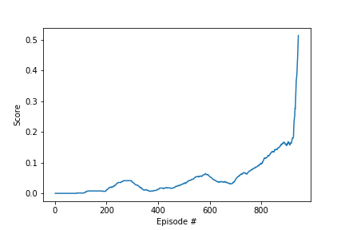
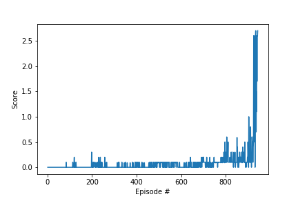
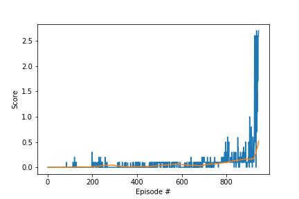

# Project Report

### Project Goal
In this environment, two agents control rackets to bounce a ball over a net. If an agent hits the ball over the net, it receives a reward of +0.1. If an agent lets a ball hit the ground or hits the ball out of bounds, it receives a reward of -0.01. Thus, the goal of each agent is to keep the ball in play. The task is episodic, and in order to solve the environment, your agents must get an average score of +0.5 (over 100 consecutive episodes, after taking the maximum over both agents).

### Environment Details

* **Number of agents**: 2;
* **State Space**: The observation space consists of 24 variables corresponding to the position and velocity of the ball and racket;
* **Action Space**: Two continuous actions are available, corresponding to movement toward (or away from) the net, and jumping;
* **Rewards**: If an agent hits the ball over the net, it receives a reward of +0.1. If an agent lets a ball hit the ground or hits the ball out of bounds, it receives a reward of -0.01;
* **Goal**: The goal of each agent is to keep the ball in play.

### Learning Algorithm
It was used the Deep Deterministic Policy Gradient(DDPG) algorithm, which is a Policy Gradient appoach. The algorithm is using the Actor-Critic approach.

The Actor is a neural network that approximates a deterministic policy, It takes in input the state and the output is an array of values, one for each action. It approximates the policy π(a|s;θπ). This policy is deterministic and it represents the policy value in the action space, with values in the range [-1,1].

The Critic is used to give feedback about the value of the input state observed by the actor and the action considered by the actor for that state. The feedback is computed using the gradient of the the advantage function computed using the tuple (state, next_state, action, reward) sampled from the memory buffer.

Both Actor and Critic have a target and regular networks. The target network is used to define the desiredtarget, avoiding to have the same network for considering the prediction and the target. This is the same idea used in the DQN algorithm.

A soft update approach is implemented, which means that the target network is updated more often but with a smmaler change.

The DDPG, as many policy gradient algorithm, suffers from having large variance, due to their Monte Carlo approach in computing the cumulative reward. To reduce the variance, a Temporal Difference approach is used together with bootstrapping of one, this approach reduces the variance but introduces a bias.

The exploration of the action space is done by injecting a noise after the action has been selected from the Actor Network.

### Network Architectures

#### Actor
```
Input nodes (24) 
Fully Connected Layer (400 nodes, Relu activation) 
Batch Normlization
Fully Connected Layer (300 nodes, Relu activation) 
Ouput nodes (2 nodes, tanh activation)
```

#### Critic
```
Input nodes (24) 
Fully Connected Layer (400 nodes, Relu activation) 
Batch Normalization
Fully Connected Layer (300 nodes, Relu activation) 
Ouput nodes (1 node)
```

### Chosen Hyper-Parameters

| Hyper-Parameters | Description                                           |  Default   |
| ---------------- | ----------------------------------------------------- | :--------: |
| `random_seed`    | The random seed                                       |   `667`    |
| `lr_actor`       | Learning rate for the Actor Model                     |   `2e-4`   |
| `lr_critic`      | Learning rate for the Critic Model                    |   `2e-4`   |
| `w_decay`        | L2 weight decay for Critic Model                      |    `0`    |
| `buffer_size`    | The replay memory buffer size                         | `int(1e5)` |
| `batch_size`     | Mini-batch size                                       |   `128`    |
| `gamma`          | Reward discount factor                                |   `0.99`   |
| `tau`            | For soft update of target parameters                  |   `1e-3`   |
| `add_noise`      | Add noise to action space during training             |   `True`   |
| `update_every`   | Time step interval for learning from experiences      |    `10`    |
| `num_update`     | Number of times to updatea after timesteps            |    `10`    |
| `target_avg`     | Average score required to consider environment solved |    `0.5`   |
| `max_t`          | Maximum number of steps to take in the episode        |   `1000`   |
| `n_episodes`     | Maximum number of episodes to train the models        |   `2000`   |

### Training Results
Below is the plot showing the training epochs and their respective rewards.


*Average scores(left plot) and scores per episode(right plot)*


*Average scores(yellow line) and scores(blue line) per episode*

### Future Work
* Implement Distributed Distributional Deterministic Policy Gradients (D4PG) algorithm and compare its performance with DDPG;
  * Apply the changes that promise learning improvement.
* Implement PPO and A3C algorithms and compare their performances with DDPG;
* Experiment other artificial neural networks structures in search of a topology that increases the convergence rate;
* Apply this algorithm to solve some more complex environment, such as found at soccer agents.
